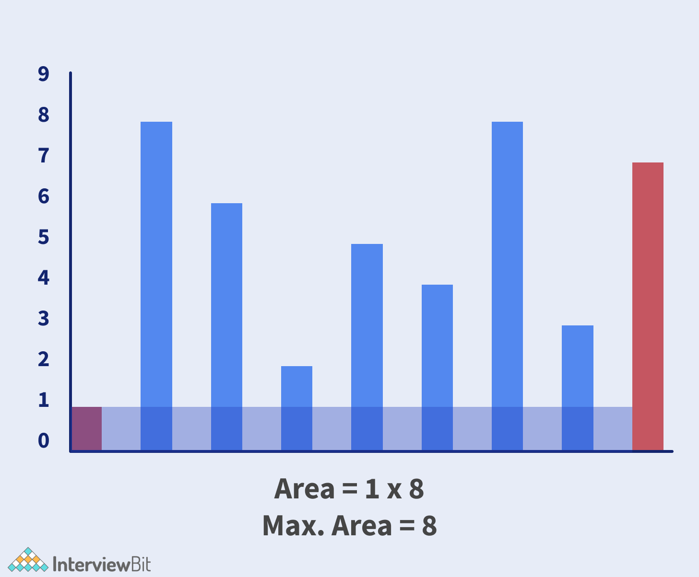

# Simple Go Rest API
Simple Rest API use golang and running on Docker. The apis for "Find two lines that together with the x-axis form a container, such that the container contains the most water and return the maximum amount of water a container can store."

## Preview

## How To Run
- docker compose up -d

## How To Off
- docker compose down

## Hit api
- http://localhost:8081/api/check

reference:
https://leetcode.com/problems/container-with-most-water/description/